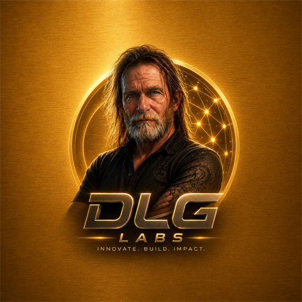

# LEONA by DLG Labs



Controlled public benchmark and transparency kit for autonomous code repair.

Website: [www.dlglabs.org](https://www.dlglabs.org)
Contact: [founder@dlglabs.org](mailto:founder@dlglabs.org)

This repository is intentionally a public release surface, not the complete private product. It contains benchmark evidence, a public dashboard, telemetry schemas, a lightweight orchestration shell, a terminal viewer, the synthetic benchmark framework, and a clearly separated true-LLM repair validation snapshot.

## What Is Included

- `dashboard/` - static public benchmark dashboard with embedded repair telemetry.
- `bull/client-preview/` - client-safe BULL repair portal preview with sample data.
- `benchmark-framework/` - procedurally varied benchmark generator and validator.
- `telemetry/` - public telemetry field contract and validation notes.
- `tui/` - lightweight local terminal viewer for benchmark summaries.
- `orchestration-shell/` - simple command wrappers for evidence validation.
- `evidence/` - raw benchmark reports and JSON result artifacts.
- `docs/` - technical brief and public/private release boundary.
- `docs/evidence-provenance.md` - operator disclosure, governance-layer separation, and evidence-integrity requirements.

## What Stays Private

- Advanced orchestration internals.
- Multi-board routing implementation.
- Repair heuristics and policy tuning.
- Provider routing and enterprise control paths.
- Exact internal model IDs and unreleased model-vs-model comparison data.
- Local write authority and execution chokepoints.
- Secrets, private configs, and unpublished roadmap controls.

## Public Model Labeling

Public benchmark artifacts use generalized model labels such as `local-14b-code-model`. Exact internal model IDs, provider tuning notes, and private model comparison telemetry remain private unless DLG Labs separately approves their release.

## Evidence Summary

- Controlled synthetic benchmark: 1,000/1,000 passing repair cases.
- Real OSS deterministic mutation-replay attempts: 5/5 passing attempts.
- Adaptive true LLM OSS mutation-repair validation: 23/50 passing attempts with 27/50 retained as `MODEL_LIMITATION`.
- Unauthorized mutation attempts: 0.
- Controlled test-file modifications: 0.
- Controlled rollback events: 5.

## Claim Boundary

For deterministic replay:

> This validates the benchmark harness, mutation boundaries, rollback system, telemetry, and evidence pipeline. It does not prove unknown-bug autonomous reasoning.

The controlled 1,000-case benchmark and deterministic OSS replay evidence validate the harness, mutation boundaries, rollback discipline, diffs, commits, and telemetry pipeline.

For true LLM repair:

> This evaluates actual model-driven repair attempts using pytest telemetry and authorized source context. Successes and failures are preserved honestly.

The true-LLM validation is separate. It measures model-generated diagnosis and patch creation without known-answer repair replay. Current public evidence shows the pipeline works and fails closed, while true LLM repair results remain separate from deterministic replay results.

## Operator Disclosure

Codex was used as a development/operator assistant to launch commands, inspect outputs, and guide repository maintenance. LEONA performed the governed repair benchmark execution through its own repair pipeline, validation layer, rollback system, mutation constraints, and telemetry generation.

Codex-assisted operation exercised LEONA's repair infrastructure. LEONA generated governed benchmark telemetry.

## Governance Layer Separation

- Codex governance: operator/development safety layer for command execution, repository maintenance, output inspection, and app-development risk control.
- LEONA governance: product repair/governance layer for repair attempts, patch parsing, validation, rollback, mutation boundaries, immutable-test enforcement, and telemetry.

Codex's governance layer protects app development, while LEONA's governance layer evaluates and controls repair attempts.

## Evidence Integrity Requirements

Valid LEONA repair evidence requires:

- LEONA repair pipeline called the model provider.
- LEONA generated or received proposed patches through its repair pipeline.
- LEONA parsed, validated, and applied patches.
- Pytest before/after results were produced by LEONA's runner.
- Telemetry artifacts were produced by LEONA.
- Tests remained immutable.
- Unauthorized mutations were rejected or recorded.
- Codex did not inject known-answer fixes into the repair loop.

## Reproducibility Direction

The long-term goal is to make the benchmark independently runnable without Codex through commands like:

```powershell
node run_oss50_llm.js --count 50
```

This reduces ambiguity for outside reviewers by making LEONA's benchmark execution reproducible without relying on an operator assistant.

## Quick Start

Open the dashboard:

```powershell
start .\dashboard\index.html
```

Open the BULL client preview:

```powershell
start .\bull\client-preview\index.html
```

Validate the bundled evidence:

```powershell
node .\tools\validate_public_evidence.js
```

Render a terminal summary:

```powershell
node .\tools\render_summary.js
python .\tui\leona_tui.py --limit 5
```

Open the lightweight landing page:

```powershell
start .\index.html
```

Read the public benchmark excerpts:

```powershell
start .\docs\benchmark-report-excerpts.html
```

GitHub Pages custom domain:

```text
www.dlglabs.org
```

Public contact:

```text
founder@dlglabs.org
```

## Evidence Integrity Note

Some raw evidence files include legacy local provenance strings from the private development environment. Those strings are preserved so the evidence remains traceable. They do not include the private core implementation.

## License

See `LICENSE.md`. This controlled release is source-available for review unless DLG Labs publishes a separate open-source license.
